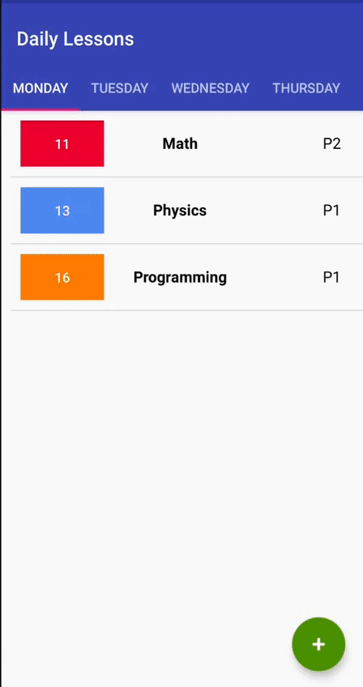

# Daily Lessons
Android app agenda, to organize your week by inserting, modifying and removing lessons.
 
Google Play: https://bit.ly/3pwuNGe

 

  

#### This app has following packages:
1. **ui**: View classes along with their corresponding Presenter.
2. **data**: It contains all the data accessing and manipulating components.
3. **utils**: Utility classes.

#### This is a MVC Java Project
- I used TinyD to create a local DB to save and managed user data about all lessons inserted in the application (https://tinydb.readthedocs.io/en/latest/index.html)
- I used Google Mobile Ads to show banner and interstitial

 

  

